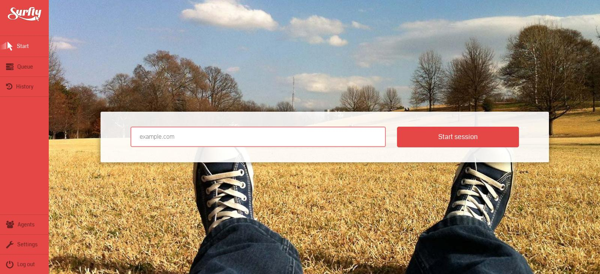

#The Surfly Tutorial

###Welcome to Surfly

Surfly's co-browsing technology enables you to share your browser with others. To start a Surfly session, enter the url of your chosen webpage into the 'start session' panel on your admin page. You can invite people to join you by sharing the session url with them. This is the easiest and quickest way to co-browse and doesn't require any configuration.

Alternatively, if you wish to use Surfly as a feature on your own website, you can add the Surfly widget code to your website. Adding this code already allows you to start co-browsing, and Surfly works without any alterations. Small additions to the code allow you to fully customize the appearance and behavior of the Surfly session. You can choose to use as much, or as little, of Surfly's functionality within your own product.

####The chrome extension

If you do not want to immediately add the code to your website, but still want to take a look at how Surfly's integration can work for you, use our Chrome extension. This extension will add our Javascript snippet code to any website you are currently browsing, it will also give you all the options to easily configure the snippet and try out various settings. 

In order to install the extension do the following: 
 - Download the Chrome Extension
 - Open ChromeGo to Tools / Preferences / Settings (depends on your OS)
 - Go to ‘Extensions’
 - Click on ‘Load unpacked extension’
 - Point it to the downloaded file

### The Documentation

The documentation aims to give you a good understanding of the co-browsing functionality Surfly has on offer, and the ways in which you can integrate it and adapt it into your own application. The
documentation is divided into several parts:                     

##### The Introduction

The introduction explains what a co-browsing Surfly session is, and how it works. We outline the main features that Surfly offers, and the ways in which it can be adapted to suit your needs.

##### The Tutorial

If you would like to learn more about Surfly, follow our step by step guide as we integrate Surfly into our example application. 
Major steps and changes are illustrated by an image/gif and, for each modification, you can refer to our repository, where you'll find a corresponding commit.

##### The Widget options

For quick reference, the widget options gives a list of the different changes you can make to either the code snippet, or the options panel in your Surfly account. If the options panel and the 
code snippet have conflicting settings, the setting in the code snippet has priority.

##### The Javascript and REST API

For a deeper integration of Surfly, and a list of the functions we have on offer, please see the Javascript and REST API.

##### FAQ's

Here we answer questions on functionality, technology, pricing and security.
If you do not find what you were looking for, please don't hesitate to contact us.

| Please note: |
| ------------- | 
| If you wish to integrate Surfly, you need to give Surfly access to the server. This is especially important when you are developing locally.  | 

