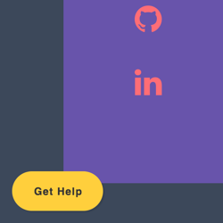
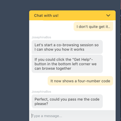

<a href="https://www.surfly.com/"></a>
#Surfly integration with Tag Manager

Tag management systems are mostly used to inject Javascript into websites for marketing purposes. But with most tag managers it is possible to inject any type of html into your website, and not only scripts. You can add text, buttons, etc. and even implement Surfly through a tag management system.

In this chapter we'll show you how to add a basic Surfly implementation to your website using Google Tag Manager.

####The Features

Within this example we make use of the [session-id approach](../tutorial/advanced-integration.md), which gives you the following use-case:

- The user is already chatting with an agent, and is directed to the "Get Help"-button to start a Surfly co-browsing session



- After the user clicks the "Get-Help"-button, a Surfly session is initiated, and the button now shows the session-id (which is by default a four-number code)
- The user can now pass the session-id to the agent. The agent then uses the session-id to identify the correct session from the queue in his/her admin panel



- The agent joins the session, and the session now becomes visible to both users

####How it works

With Google Tag Manager you are able to inject HTML into your website. As long as you put it in between the correct tags, you can add divs, css, javascript, etc., to your website's page(s). The tag you inject through GTM can even contain more than one script, and even scripts of a different nature.

In short, you add a tag to your website as follows:

- Register at https://www.google.nl/tagmanager/
- Log in, and create an account for your website
- Add an account-name and a container (which is the url) and set the destination
- You get two code snippets, follow the instructions on how to add these to your website
- You can create a new tag on the “workspace” console, or click on “tags” >> “new”
- Add a name
- Click on “tag configuration ” select "custom tag", then add the code snippet. You can add anything as long as it’s in HTML
- Enable document.write
- Add a trigger. Here you can select the pages on which you want the tag to be implemented
- When you’re ready to review, click the carret-down next to “publish” to create a new version
- Go to “versions” >> “actions” >> “review” to test the tag's functionality on your website
- If everything is working properlyl, go to “versions” >> “actions” >> “publish” to make your tag go live

 For more info on Google Tag Manager, please visit the website https://www.google.com/analytics/tag-manager 

####The Tag

Below, you'll find an example of how a tag, using the session-id approach, would look like. The example also includes the option of adding a third-party chat solution to your website. In this case we've used Olark.

The tag is structured as follows:

- First we add a div with an id of "footer". In the div we create two buttons: one to start a Surfly session and one to end it
- Then we add the css by placing it between style tags
- The last part of the tag is Javascript. First, we've made sure that GTM will show our buttons. Then we've added the Surfly snippet, the Surfly init function, a sessionStart() function, the Olark snippet and a sessionEnd() function.

```javascript
//Buttons to control the Surfly session
<div class="footer" id="footer">
  <button class="basic-button" id="btn-start-session" onclick="sessionStart()"><p id="id-cover">Get Help</p></button>
  <button class="basic-button" id="btn-end-session" onclick="sessionEnd()">Stop sessie</button>
</div>

//Button styling
<style type="text/css">
  .basic-button {
    background-color: #ffd05b;
    width: 115px;
    border: 1px solid #ffd05b;
    border-radius: 33px;
    height: 50px;
    font-size: 14px;
    color: #333333;
    letter-spacing: 1px;
    font-family: sans-serif;
    font-weight: bold;
    position: absolute;
    left: 15px;
    bottom: 15px;
    box-shadow: 2px 2px rgba(0, 0, 0, 0.1);
    position: fixed;
  }

  .basic-button:hover {
    cursor: pointer;
  }

  .basic-button p {
    margin-top: 14px;
    font-size: 13px;
  }

  #btn-end-session {
    display: none;
  }
</style>

<script>
//Make sure that GTM doesn't hide the buttons
  document.getElementById('footer').parentElement.removeAttribute('style');
  
//Add the Surfly snippet
  (function(s,u,r,f,l,y){s[f]=s[f]||{init:function(){s[f].q=arguments}};
  l=u.createElement(r);y=u.getElementsByTagName(r)[0];l.async=1;
  l.src='https://surfly.com/surfly.js';y.parentNode.insertBefore(l,y);})
  (window,document,'script','Surfly');

// Implement the Surfly init code, ADD YOUR OWN WIDGET KEY 
  Surfly.init({widget_key:'** add your own Surfly widget key'}, function(init) {
    if (init.success) {
      if (Surfly.currentSession) {
        // Laat binnen de sessie de btn-end-session zien
        document.getElementById('btn-end-session').style.display="block";
        // Zorg ervoor dat de btn-start-session ruimte maakt om de session-id te laten zien
        document.getElementById("btn-start-session").style.visibility="hidden";
      }
    }
  });

//Function sessionStart() that starts the Surfly session, so that it can be applied to the "Start Session"-button
//Add options according to you wishes
  function sessionStart() {
    var settings = {
      block_until_agent_joins: false,
      hide_until_agent_joins: true,
      start_docked: true,
      cookie_transfer_enabled: true,
      cookie_transfer_proxying: false,
      splash: false
    };
//Code that shows the session-id so that it can be passed to the helpdesk agent
    Surfly.session(settings)
    .on('session_started', function(session, event) {
      document.getElementById("id-cover").style.display = "none";
      console.log(session);
      var showId = document.getElementById("btn-start-session");
      showId.style.display = "block";
      showId.textContent = session.pin;
    }).startLeader();
  }

//Add your chat box snippet code (for this example I have used Olark)
  if(!window.__surfly){
  
    //REPLACE THIS PART WITH YOUR OWN CHAT BOX SNIPPET
      window.olark||(function(c){var f=window,d=document,l=f.location.protocol=="https:"?"https:":"http:",z=c.name,r="load";var nt=function(){
      f[z]=function(){
      (a.s=a.s||[]).push(arguments)};var a=f[z]._={
      },q=c.methods.length;while(q--){(function(n){f[z][n]=function(){
      f[z]("call",n,arguments)}})(c.methods[q])}a.l=c.loader;a.i=nt;a.p={
      0:+new Date};a.P=function(u){
      a.p[u]=new Date-a.p[0]};function s(){
      a.P(r);f[z](r)}f.addEventListener?f.addEventListener(r,s,false):f.attachEvent("on"+r,s);var ld=function(){function p(hd){
      hd="head";return["<",hd,"></",hd,"><",i,' onl' + 'oad="var d=',g,";d.getElementsByTagName('head')[0].",j,"(d.",h,"('script')).",k,"='",l,"//",a.l,"'",'"',"></",i,">"].join("")}var i="body",m=d[i];if(!m){
      return setTimeout(ld,100)}a.P(1);var j="appendChild",h="createElement",k="src",n=d[h]("div"),v=n[j](d[h](z)),b=d[h]("iframe"),g="document",e="domain",o;n.style.display="none";m.insertBefore(n,m.firstChild).id=z;b.frameBorder="0";b.id=z+"-loader";if(/MSIE[ ]+6/.test(navigator.userAgent)){
      b.src="javascript:false"}b.allowTransparency="true";v[j](b);try{
      b.contentWindow[g].open()}catch(w){
      c[e]=d[e];o="javascript:var d="+g+".open();d.domain='"+d.domain+"';";b[k]=o+"void(0);"}try{
      var t=b.contentWindow[g];t.write(p());t.close()}catch(x){
      b[k]=o+'d.write("'+p().replace(/"/g,String.fromCharCode(92)+'"')+'");d.close();'}a.P(2)};ld()};nt()})({
      loader: "static.olark.com/jsclient/loader0.js",name:"olark",methods:["configure","extend","declare","identify"]});
      /* custom configuration goes here (www.olark.com/documentation) */
      olark.identify('** add your own Olark identifier **');  
    //UNTIL HERE
    
  }

//Function that ends the session, so that it can be applied to the "end Session"-button
  function sessionEnd() {
    Surfly.currentSession.end();
  }
</script>
```
 Google Tag Manager puts everything in an iframe, and adds `<style =“display: none; visibility: hidden;”>` to the code you inject. Make sure you remove this attribute within the tag (as shown in the example above), otherwise the divs you've added will not appear. 

If you choose to use this code snippet on your website, there's a couple of things you need to take into account:

- You might have to adjust the CSS if you want the "Get Help"-button to match your own chatbox styling
- Read through the code, and make sure you add both your own Surfly widget key as well as your own chatbox code snippet
- If you're ready for a more advanced integration, have a look at the [surfly options](../widget-options.md), and adjust the options in the above example if needed