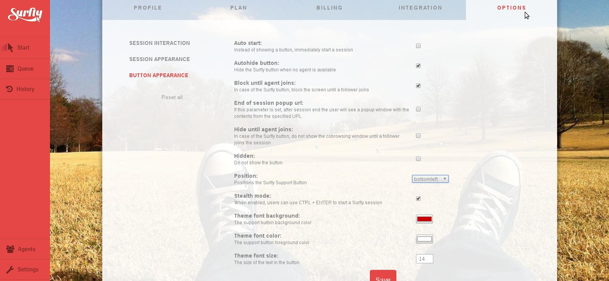

# FAQ

If you do not find the answer to your question in one of the sections below, please do not hesitate to contact us.

## Functionality

<!--sec data-title="Introduction" data-id="section50" data-show=true ces-->

Insert markdown content here (you should start with h3 if you use heading).

<!--endsec-->
<button class="section" target="section50" show="Show next section" hide="Hide next section"></button>

<!--sec data-title="Is videochat included?" data-id="section0" data-collapse=true ces-->

Yes, all our plans, even the free plan come included with high quality videochat built on top of WebRTC.

<!--endsec-->

<!--sec data-title="How many sessions can I create?" data-id="section1" data-collapse=true ces-->

Only the free plan has a monthly limit on the amount of sessions you can create, all paid plans come with an unlimited number of sessions.

<!--endsec-->

<!--sec data-title="Can I invite any team members?" data-id="section2" data-collapse=true ces-->

All our paid plans allow you to invite multiple team members and manage them from a single account.

<!--endsec-->

<!--sec data-title="Can I integrate Surfly on my website?" data-id="section3" data-collapse=true ces-->

Yes! Just add a few lines of javascript to your website and you or your clients will be able to directly start Surfly sessions straight on your website. This is great for the support case where you can use our widget to show a support button on your website.

<!--endsec-->

<!--sec data-title="Can I control which parts of my website are visible?" data-id="section4" data-collapse=true ces-->

With our business plan we offer the possibility to tweak which elements should be synchronized, this gives you fine-grained control over which HTML elements should be considered confidential.

<!--endsec-->

<!--sec data-title="Do you offer a full whitelabel solution?" data-id="section5" data-collapse=true ces-->

With our enterprise offering we offer the option to remove all visible Surfly branding from the Surfly session.

<!--endsec-->

## Technology

<!--sec data-title="Which browsers are supported?" data-id="section6" data-collapse=true ces-->

Cobrowsing with Surfly will work on all modern browsers: Chrome, Firefox, Safari, Internet Explorer 10+, Opera. It will also work on mobile Android devices using the Chrome browser and on Apple iOS devices Surfly supports Safari. Surfly’s videochat uses WebRTC and will run on Chrome, Firefox and Opera without the need to install any software. On other browsers a plugin can be installed the first time videochat is started.

<!--endsec-->

<!--sec data-title="Why is Surfly so fast?" data-id="section7" data-collapse=true ces-->

We make use of an advanced content-rewriting proxy which allows us to send over the real HTML content from our high performance network. This is in contrast with for example a pure Javascript approach which relies on the upstream of all participants to send over the data.

<!--endsec-->

<!--sec data-title="How does Surfly differ from screensharing?" data-id="section8" data-collapse=true ces-->

A few things differentiate us from screensharing:
1. We do not require any software to be installed
2. We send over the real content without any loss of quality
3. We can enable high performance video synchronization

<!--endsec-->

##Security

<!--sec data-title="Does Surfly use secure connections?" data-id="section9" data-collapse=true ces-->

Yes, all connections to Surfly are secured using HTTPS.

<!--endsec-->

<!--sec data-title="Do you store any session data?" data-id="section10" data-collapse=true ces-->

No. All session data only lives within memory during the time of the session. We do not store any session data on disk.

<!--endsec-->

<!--sec data-title="Are you PCI compliant?" data-id="section11" data-collapse=true ces-->

Yes, not only do we use HTTPS connections everywhere, but we also never store your creditcard as this is all handled by Stripe.

<!--endsec-->

<!--sec data-title="Can I host Surfly on-premise?" data-id="section12" data-collapse=true ces-->

For larger deployment we do offer this kind of functionality, contact us if this is in your interest.

<!--endsec-->

## Pricing

<!--sec data-title="Is the FREE version really free?" data-id="section13" data-collapse=true ces-->

Yes, the free version is really free. But the number of cobrowsing sessions you can start is a limited to 5 per month.

<!--endsec-->

<!--sec data-title="Do I need a credit card for the FREE version?" data-id="section14" data-collapse=true ces-->

No, for the Free version you don’t need to have a credit-card. Also, for bigger clients we offer the option to pay by wire transfer through invoice.

<!--endsec-->

<!--sec data-title="What happens after the 14 day trial?" data-id="section15" data-collapse=true ces-->

After the 14 day trial of the Pro and Business version your credit card will be charged for the first month, starting at that date. During the 14 day trial period you can cancel your subscription at any moment and your credit card will not be charged after the first 14 days.

<!--endsec-->

<!--sec data-title="Can I pay by invoice?" data-id="section16" data-collapse=true ces-->

For enterprise clients or clients with more than 10 business seats we do offer the option to pay by invoice and wire-transfer. Please contact us for more information. Can I upgrade or downgrade my subscription? Yes, you can change your subscription at any moment. An upgrade will be effective immediately. A downgrade will be effective at the end of the current contract period (month or year).

<!--endsec-->

<!--sec data-title="Are the prices subject to VAT or sales tax?" data-id="section17" data-collapse=true ces-->

That depends on your location. Non-EU: For all customers outside the European Union, we do not have to add VAT. EU: For companies in the European Union that have a valid VAT tax ID, we do not have to add VAT. For private individuals or organisations without a valid VAT tax ID within the EU, we have to add your country’s local VAT percentage. The Netherlands: Surfly is based in the Netherlands so we have to add 21% VAT to customers (companies and individuals) based in the Netherlands.

<!--endsec-->

<!--sec data-title="Can I cancel my subscription?" data-id="section18" data-collapse=true ces-->

Yes, you can cancel your subscription at any moment. The subscription will remain active until the end of the current contract period (month or year). Alternatively, you can also downgrade to the Free Version.

<!--endsec-->

<!--sec data-title="Can I cancel my subscription?" data-id="section19" data-collapse=true ces-->

Surfly’s license is user based, this means that while any seat can create an unlimited number of sessions each seat is to be used by a single user. Sharing a single seat over multiple users is not allowed.

<!--endsec-->

##Initial Setup

<!--sec data-title="Where can I find the code snippet?" data-id="section20" data-collapse=true ces-->

The javascript snippet can be found when you login to your Surfly account. Click on the "settings" link on the menu bar to the left of the screen, and then select "Integration". You may have to click on "generate API keys", before the javascript snippet is shown. You will also have to add your websites domain name (e.g example.com) to the "specify domain names" section just below the code snippet, then click on "setup widget".

<!--endsec-->

<!--sec data-title="Do I have to put the code snippet on every page?" data-id="section21" data-collapse=true ces-->

Unless you want to use session continuation, you only need to put the code snippet on the pages you wish to start a session from. If you would like to use [session continuation](introduction/integration_options.md/#session_continuation), the code snippet should be on every page you want to transfer cookies from.

<!--endsec-->

<!--sec data-title="How do I take a call?" data-id="section22" data-collapse=true ces-->

Login to your Surfly account and navigate to the "Queue panel". Click on the "take call" button next to the session request. You will enter a Surfly session with the user who initiated the request.

<!--endsec-->

<!--sec data-title="How can I customise Surfly's widget?" data-id="section23" data-collapse=true ces-->

You can either specify your preferences directly in the code snippet (see the [widget options](widget_options/reference.md) for more details), or from the 'options' panel in your Surfly account. 

Changes to the widget code have priority over changes to the code snippet. 
<!--endsec-->

