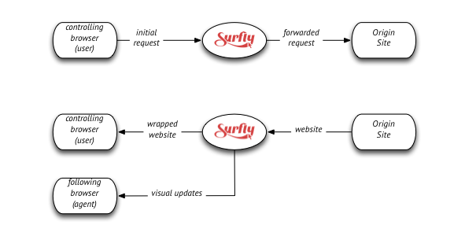

# Surfly Technology

This chapter is dedicated to explaining how Surfly works compared to other solutions, as well as creating a better understanding of our co-browsing software. This will make it easier to implement our API and understand the code.

#### Co-browsing vs. Screen-sharing{#co-browsing-screen-sharing}

There are countless co-browsing and screen-sharing solutions on offer. Sometimes it is not immediately clear what the differences are between them. First of all, let's filter down to the distinction between co-browsing and screen-sharing.

Unlike co-browsing, screen-sharing does not limit itself to the web browser. With a screen-sharing solution you are able to share your complete desktop. There are some benefits to this, but from a security perspective it's not the safest solution. Would you feel comfortable giving others access to your computer? So there's a bond of trust that needs to exist between users.

Also, screen-sharing solutions are pixel-based, which means that the controller constantly takes snapshots of the screen and then sends these to the other side in compressed form. The drawback of this approach is that screen updates are slow and of low quality.

What most screen-sharing and co-browsing solutions, other than Surfly, have in common, is that both rely on external software that needs to be installed by both users. This makes it unsuitable for most web situations as people are often unwilling to install extra software that circumvents the browser's security measures.

#### Javascript solutions{#js-co-browsing}

With Javascript based solutions, a widget is created in which the Javascript of the original page is being loaded. This process requires a lot of bandwith since requests from the user in control continuously need to be sent to the website, then to the co-browsing solution, then back to the controlling user as well as the followers.

There are also many limitations to this approach. One major issue is that the iframes loaded from another domain have a different Javascript scope. This means that, because of the cross domain policies, these iframes can't be controlled by the Javascript that the co-browsing solution sends over to the users. Second, audio and video are usually not synchronized. Furthermore, it is unsafe to handle logged-in sessions, as they are usually only possible if login credentials are sent to the followers; otherwise the followers do not have access to session-specific data.

##### Co-browsing with Surfly{#surfly-co-browsing}

Surfly distinguishes itself by using a unique combination of Javascript and a smart content rewriting proxy. This is how it works:

* when the leader starts a session, the browser sends a request to the Surfly proxy
* the request is then modified in a way that it looks as if the original request came from surfly.com
* this request is then sent to the original site that the leader wants to co-browse
* the website sends back the response to the Surfly proxy
* the Surfly proxy then modifies the data so that it can be loaded into an iframe that rests on top the original page
* both the leader and the follower now interact with the website as it is loaded within the iframe. From this point, there's only communication between the user's browsers and the proxy, and the requests don't continuously have to be sent to the original website anymore

This approach enables us to overcome cross-domain policies and have all elements on the site (including iframes) function correctly within the co-browsing session. This means that audio and video are synced as well. In addition, all visual updates can be efficiently captured. The proxy approach also allows us to provide both the user and the agent with a very smooth co-browsing experience that is much faster than other solutions.

* Surfly is safe; all connections to Surfly are encrypted and security tokens or passwords will never be sent to the follower. The secure proxy allows ‘logged-in sessions’. This means that secure sessions with session-specific resources just work. Next, we automatically make sure that all content will function correctly with the co-browsing session: even those that are not served from the same domain, such as widgets or plugins.
* With Surfly there is no need to install any plugin or software; it works within the browser tab.
* We do not share the state between the two different browsers, but we only send over the visual changes of one to the other. This makes our approach much more secure and robust.
* At Surfly we make sure that what the controller sees on their screen will be matched by all followers. This includes scroll position and the state of responsive websites.

##### In comparison: {#comparison}
| | JS Based Co-Browsing | Surfly | Pixel Based Co-Browsing | ScreenSharing |
|---|---|---|---|---|
| High Quality |  |  |  |  |
| No setup required |  |  |  |  |
| Works with iFrames |  |  |  |  |
| No Installation or Extension Required | |  |  |  |
| Can be Integrated in Existing WebApp |  |  |  |  |
| Works with legacy web technology (activex, flash) |  |  |  |  |
| Can share your desktop |  |  |  |  |

#### How the session works{#how-to-start}

Now it's time to start implementing Surfly. This can be done in three ways:

* through a [basic integration with the admin panel](../integration.md)
* with the [Javascript API](../the-surfly-tutorial.md)
* and/or with the [REST API](http://docs.surfly.apiary.io/)

How you choose to implement our API depends on how deeply you want to integrate it into your website and your workflows. In [sales](https://www.surfly.com/surfly-as-a-sales-tool/) for instance, you might want to use Surfly to demo your website or product and make this a more captivating and interactive experience for all users. This could already be done through an integration with the admin panel or a basic Javascript implementation.

In [support](https://www.surfly.com/surfly-as-a-service-tool/), you might want to co-browse together with your client to guide them through the website, and create designs together or help them fill in forms. For the latter you might have to deal with sensitive information, so Surfly provides the option of limiting co-browsing to certain pages on your website, or to mask data in form fields for other users.

You could also integrate Surfly into your already implemented helpdesk software using the REST API. You might want to add your client's location to the queue based on their IP-address for instance, so that your helpdesk agents have some background info when they join them in a Surfly session.

Surfly could also be used for educational purposes, as a lot of learning platforms use our API to create an online class room. Or maybe you would like to add Surfly as a social tool to your website to allow your users to shop together.

Surfly can be integrated in many ways, together with other software solutions. Our API is completely rebrandable according to your wishes, and it can even be made into a fully transparent layer that lays on top of your website. But most importantly, for us, safety comes first, so all Surfly sessions are HTTPS secured. Also, we even offer the option of installing the servers for you on premise.

#### Basic requirements{#basic-requirements}

- Surfly works with all modern browsers, such as: Chrome, Firefox, Internet Explorer 11 (Edge), Safari and Opera
- Set the server up to allow connections to *.surfly.com
- Since we make use of websockets, some virus software or proxy solutions can interfere with the Surfly technology. Make sure to create an exception for *.surfly.com
- Access port 443 of the installed server (regular HTTPS port)
- For videochat, Surfly makes use of WebRTC, and more specifically TokBox' solution. For more info on the TokBox requirements: https://tokbox.com/developer/requirements/
- No bandwith requirements for using Surfly. With regard to TokBox bandwith:
    - Video: 300 kbps per stream (recommended lowest level)
    - Audio: 50 kbps per stream (recommended lowest level)

#### On-premise hardware requirements{#on-premise-requirements}

The maximum number of concurrent sessions will depend on the provided hardware and the type of usage.

##### Required production (virtual) hardware

- Quad Core CPU (can also be virtualized through VMWare or AWS)
- 8GB of RAM or higher
 40GB of HD space
 100 Mbps Ethernet

##### System requirements 
- Linux Debian 8
- Hardware platform x86-64
- A public IPv4 address

##### Setup requirements 
- Surfly will need a remote root account for maintenance, monitoring and upgrades
- A TLD DNS domain reserved for co-browsing (can be supplied by Surfly)
- A wildcard SSL certificate accompanying the domain name (can be supplied by Surfly)