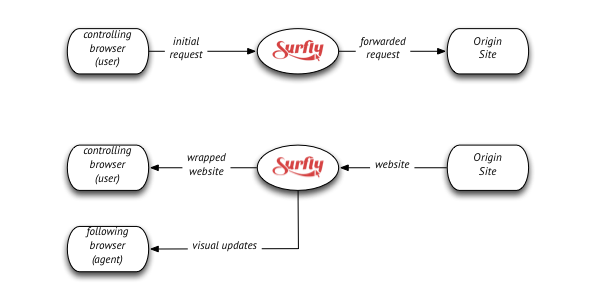

# The Technology

So let's dive into the technology behind Surfly. This chapter is dedicated to explaining how Surfly works compared to other solutions, as well as creating a better understanding of our co-browsing software. This will make it easier to implement our API and understand the code as you will become more familiar with the greater concepts behind it.

##### Co-browsing vs. Screen-sharing{#coBrowsingVersus}

Nowadays there are countless co-browsing and screen-sharing solutions on offer. To select one might be a difficult task as it is sometimes not immediately clear what the differences are between them. First of all, let's filter down to the distinction between co-browsing and screen-sharing.

This is an easy one: unlike co-browsing, screen-sharing does not limit itself to the web browser. With a screen-sharing solution you are able to share your complete desktop. There are some benefits to this, but from a security perspective it's not the safest solution. There's a bond of trust that needs to exist between users, in order for you to feel comfortable to share the contents of your computer with others.

Also, screen-sharing solutions are pixel-based, which means that the controller constantly takes snapshots of the screen and then sends these to the other side in compressed form. The drawback of this approach is that screen updates are slow and of low quality.

What screen-sharing and co-browsing solutions, other than Surfly, have in common, is that both rely on external software that needs to be installed by both users. This makes it unsuitable for most web situations as people are often unwilling to install extra software that circumvents the browser's security measures.

##### Javascript Solutions{#jsCoBrowsing}

With Javascript based solutions, a widget is created in which the Javascript of the original page is being loaded. This is a time consuming process since requests from the user in control continuously need to be sent to the website, then to the co-browsing solution, then back to the controlling user as well as the followers.

Not only is this an exhausting process, there are many limitations to it. For example, since the iframes on the original page come from an external Javascript source, they can't be loaded within the Javascript that the co-browsing solution sends over to the users. Also, it is unsafe to handle logged-in sessions, as they are usually only possible if login credentials are sent to the followers; otherwise the followers do not have access to session-specific data.

##### Co-browsing with Surfly{#surflyCoBrowsing}

Surfly distinguishes itself by using a unique combination of Javascript and a smart content rewriting proxy. This is how it works:

* when the leader starts a session, the browser sends a request to the Surfly proxy
* the request is then modified in a way that it looks as if the original request came from surfly.com
* this request is then sent to the original site that the leader wants to co-browse
* the website sends back the request to the Surfly proxy
* the Surfly proxy then modifies the data so that it can be loaded into an iframe that rests on top the original page
* both the leader and the follower now interact with the website as it is loaded within the iframe. From this point, there's only communication between the user's browsers and the proxy, and the requests don't continuously have to be sent to the original website anymore

This approach enables us to overcome cross-domain policies and have all elements on the site (including iframes) function correctly within the co-browsing session. In addition, all visual updates can be efficiently captured. The proxy approach also allows us to provide both the user and the agent with a very smooth co-browsing experience. This means that:

* Surfly is safe; all connections to Surfly are encrypted and security tokens or passwords will never be sent to the follower. The secure proxy allows ‘logged-in sessions’. This means that secure sessions with session-specific resources just work. Next, we automatically make sure that all content will work correctly with the co-browsing session: even those that are not served from the same domain, such as widgets or plugins.
* With Surfly there is no need to install any plugin or software; it just works within the browser tab.
* We do not share the state between the two different browsers, but we only send over the visual changes of one to the other. This makes our approach much more secure and robust.
* At Surfly we make sure that what the controller sees on their screen will be matched by all followers. This includes scroll position and the state of responsive websites.

##### How the Session Works{#howToStart}

Now it's time to start implementing Surfly. This can be done in three ways:

* through a [basic integration with the admin panel](../integration.md)
* with the [Javascript API](../theSurflyTutorial.md)
* or with the [REST API](http://docs.surfly.apiary.io/)

How you choose to implement our API depends on how deeply you want to integrate it into your website. If you want to create a demo for your team, or use our API for outbound sessions only (in the case of social shopping for instance), you could simply copy-paste our code snippet into your website and customize the session behaviour through the admin panel on your Surfly account page. For inbound sessions as well as a nice integration and customization of Surfly you could use the Javascript API. If you want to embed Surfly within your backend and for instance, implement the queue meta data within your other helpdesk software, the REST approach will fit your needs better.

