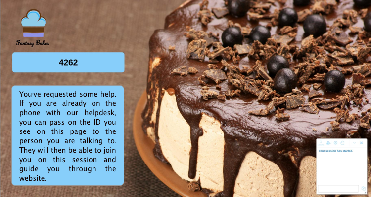

<a href="https://www.surfly.com/"></a>

# Basic Integration

<a name="website"></a>
#### Cake shop website

Our example application features a bespoke cake shop, specialising in personalized cakes.
Here is a screenshot of the home page before we integrate Surfly:


As you can see, it's a standard website with different pages and possible actions.
We are now going to integrate Surfly into our website, selecting the aspects of Surfly's functionality that best suit our needs.


<a name="integrate"></a>
#### Adding a Surfly button{#integrate}

As you can see below, after adding the widget code to our website, allowing requests originating from our website's domain, initializing a session and adding Surfly's default button , we see a red 'get live help' button. This button is shown when an agent is logged in, and, when clicked, allows us to start a session. Surfly works straight away: we can instantly start a session and receive calls without any further configuration required.

``` javascript
<script>
  (function(s,u,r,f,l,y){s[f]=s[f]||{init:function(){s[f].q=arguments}};
  l=u.createElement(r);y=u.getElementsByTagName(r)[0];l.async=1;
  l.src='https://surfly.com/surfly.js';y.parentNode.insertBefore(l,y);})
  (window,document,'script','Surfly');

  Surfly.init({widget_key:'**your widget key here**'}, function(init) {
    if (init.success) {
    // display the default Surfly button
      Surfly.button();
    }
  });
</script>
```
<div align="center">
  
</div>
<br>
When a client clicks on the red 'get live help' button, they are queue'd until an agent joins the session. The agent will be able to see the list of queue'd users in the Queue panel on the Surfly admin page.


<a name="widget"></a>
#### Set Surfly options{#widget}

We'll now change the appearance of the chatbox so we can use our own theme color. You can do this by setting an option in Surfly.button():

``` javascript
Surfly.button({chat_box_color: "#87cefa", videochat: false});
```

In the image below, you can see that the icons in the chat box are now in our website's theme color. We also chose to disable the video chat feature that is included by default, as we felt that it was not required.

 

The API has an [extensive list of widget options](../widgetOptions.md).

#### Create your own button{#startButton}

We'd like to create our own button to start a [co-browsing session](https://www.surfly.com/) so that we can customise it and control its behaviour more easily.

First of all, if you have followed the previous steps and added the basic Surfly button to your website, make sure you remove this code and replace it with the following.

* So first We create our own button and add an onclick event to start a Surfly session
* Second, we initialize the SUrfly API
* Then we write a function that sets the options we want to add to a Surfly session, as well as starts a session

``` javascript
<button class="my-custom-button" id="get_help_button" style="display: none" onclick="sessionStart()"></button>

<script>
  function sessionStart(){
    Surfly.session({chat_box_color: "#87cefa", videochat: false}).startLeader();
  }

  Surfly.init({widget_key:'**your widget key here**'}, function(init) {
    if (init.success) {
      if (!Surfly.currentSession) {
        // inside the session, hide the get help section (of id 'get_help')
        document.getElementById('get_help_button').style.display="block";
      }
    }
  });       
</script>
```
In particular, we have chosen to use the image of a cake as a get help button for our customers:


<a name="landing"></a>
#### Build your own landing page{#landing}

When a visitor initiates a session they are queue'd and, by default, have to wait for an agent to take the call before they can navigate within the session. The screen is blocked, and a red banner appears at the top of the screen with their queue pin. In our example application, the page that the user starts a session from is the home page, and consequently, this is the page that gets blocked. We would prefer to have our own custom landing page, where we can tell our customers that they are in the queue, and that an agent will be with them soon. The landing page is a convenient way to give them more information about what to expect from a Surfly session.

The flow will be as follows: the user clicks on the support button and is shown a page with their unique pin code, and our own custom text. When an agent joins them, the user is redirected to the home page.

* First, we adapt our custom button (get_help_button in our example), replacing the previous sessionStart() function with an onclick event that will redirect the user to our landing page
* Then we need to add Surfly's snippet code to the landing page so that we can automatically start a session from this page.
* To be able to use the landing page, we have to remove the red banner blocking the session by setting the ```block_until_agent_joins``` option to ```false``` in the settings options.
* Also, we would like the user to be redirected to the home page when an agent joins them. To do this, we can use the Javascript API to redirect the session to another url when the first viewer joins by using the .on() function to catch this event:
* Finally, we want to display the unique identifier (or pin) on the landing page when a session starts. This is so that the customer is aware that they're in the queue and, in some cases, so that they can communicate the ID to an agent that they were already in contact with (over the phone for example). The agent will then be able to find the customer on the queue page, and join their session.
To do this, we use the [SurflySession API](../javascript-api/surflysessionApi.md) to get the pin.

``` javascript
<button class="my-custom-button" id="get_help_button" onclick="landing()"></button>

<script>
  (function(s,u,r,f,l,y){s[f]=s[f]||{init:function(){s[f].q=arguments}};
  l=u.createElement(r);y=u.getElementsByTagName(r)[0];l.async=1;
  l.src='https://surfly.com/surfly.js';y.parentNode.insertBefore(l,y);})
  (window,document,'script','Surfly');

  function landing(){
    window.location.href = '/landing_page';
  }

  var settings = {
    block_until_agent_joins: false,
    hide_until_agent_joins: true,
    splash: false
  };

  Surfly.init({widget_key: '** Your widget key **'}, function(init) {
    if (init.success) {
      if(!Surfly.currentSession){
        Surfly.session(settings)
        .on('viewer_joined', function(session, event) {
        // if a viewer joins and they are the first then redirect to home page
          if(event.count == 1){
            session.relocate("https://surfly.com");
          }
        })
        .on('session_started', function(session, event) {
        // display the session-id
          var showId = document.getElementById("session-id");
          showId.style.display = "block";
          showId.textContent = session.pin;
        }).startLeader();
      }
      else {
        document.getElementById('cancel-session').style.display = "block";
      }
    }
  });
</script>
```

We now have our own personalised landing page to greet our customers:



<a name="session"></a>
#### Field masking{#session}

When a client places an order during a session, we don't want the agent to be able to see their payment details and we would therefore like to mask some form data from the agent.

To enable [field masking](../introduction/integration_options.md/#field_masking) (the follower will not see the leader's input), add the ```surfly_private``` attribute to fields containing sensitive information:
``` html
<span>Card Number</span>
<input type="text" size="20" data-stripe="number" surfly_private>
```
In our example, we only use field masking on the last three fields of our order form as they contain information about the client's card. As can be seen in the image, the agent only see crosses (x's) instead of the leader's input:


Please note:
Whilst the leader can mask their data, and hide it from the followers, the followers cannot hide their data from the leader. 

<a name="popup"></a>
#### End of session popup{#popup}

After the session ends, we will display a survey in a pop-up window. This is a useful way of getting feedback from the session.

We will use the ```end_of_session_popup_url``` option to point to the url of our survey page. Again, we add this as an option in the 'settings' variable:

``` javascript
var settings={
  widget_key:'**your widget key here**',
  end_of_session_popup_url: "https://example.com/survey"
};
```

You can also pass the url as a parameter in ```Surfly.session().end( [redirectUrl] )```. However, the ```end_of_session_popup_url``` option has priority over this function.


<a name="chat"></a>
#### Integrate an already existing chat solution{#chat}

Finally, we'd also like to be able to continue chatting with our clients in a Surfly session. In our application, we were using Zopim prior to integrating Surfly.

* First, we need to remove Surfly's default chat box by adding the ```docked_only``` option to the session settings:

Please note:
We could also use the 'ui_off' option instead of 'docked_only' considering that in both cases the Surfly's default chatbox is disabled.  

* Then, we can simply add the Zopim snippet code provided to all the pages of our website, so that we'll be able to communicate with our clients inside and outside of a Surfly session without any disturbance when we enter or exit one.

Please note:
We added a condition in the beginning of the script to make sure that a second Zopim chat window doesn't open when a Surfly session starts.


``` javascript
<script>
  var settings={
    widget_key:'**your widget key here**',
    docked_only: true
  };

  if(!window.__surfly){
    // Adding Zopim Live Chat
    window.$zopim||(function(d,s){var z=$zopim=function(c){z._.push(c)},$=z.s=
    d.createElement(s),e=d.getElementsByTagName(s)[0];z.set=function(o){z.set.
    _.push(o)};z._=[];z.set._=[];$.async=!0;$.setAttribute("charset","utf-8");
    $.src="//v2.zopim.com/?**key**";z.t=+new Date;$.
    type="text/javascript";e.parentNode.insertBefore($,e)})(document,"script");
    // End of Zopim Live Chat Script
  }
</script>
```

